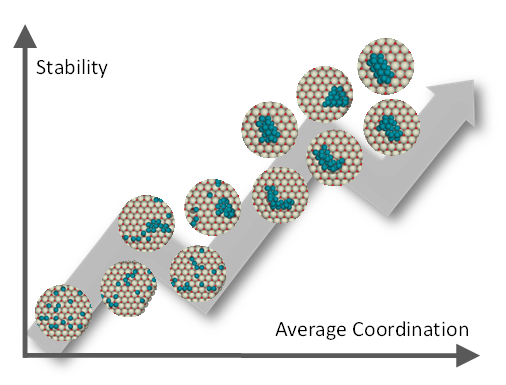
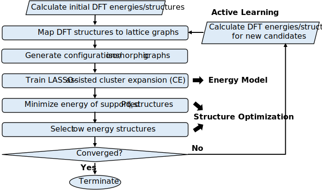

# Pdn Cluster Structure Optimization
Dataset, statistical learning-based energy model and structure optimization algorithms in Python for subnanometer Pd clusters supported on Ceria

## Computational Framework 

## Pd cluster structure dataset 
The dataset contains Pdn cluster structures in the size range from 1 to 21.
- [DFT dataset](/dataset/DFT_structures)
- [Configuration (lattice mapping of DFT structures) dataset](/dataset/configurations)

## Pd cluster energy model 
- [LASSO-assisted Cluster Expansion (CE), an efficient mapping from structures to energies](/lasso-assisted-CE)

## Structure optimization algoirthms in cannoical ensembles 
The detailed usage can be found in the links.
- [Metropolis MC](/structure-optimization/metropolis-MC)
- [Cluster Genetic Algorithm (CGA)](/structure-optimization/CGA)

## Dependencies 
- Python version 3.6+
- [Numpy](https://numpy.org/): Used for vector and matrix operations
- [Matplotlib](https://matplotlib.org/): Used for plotting
- [Scipy](https://www.scipy.org/): Used for linear algebra calculations
- [Pandas](https://pandas.pydata.org/): Used to import data from Excel files
- [Sklearn](https://scikit-learn.org/stable/): Used for training machine learning models
- [Seaborn](https://seaborn.pydata.org/): Used for plotting
- [Networkx](https://networkx.github.io/): Used for graph opertations

## How to cite this work
[Wang, Y., Su, Y., Hensen, E. J. M., & Vlachos, D. G. (2020). Finite-Temperature Structures of Supported Subnanometer Catalysts Inferred via Statistical Learning and Genetic Algorithm-Based Optimization. ACS Nano. https://doi.org/10.1021/acsnano.0c06472](https://pubs.acs.org/doi/10.1021/acsnano.0c06472)
