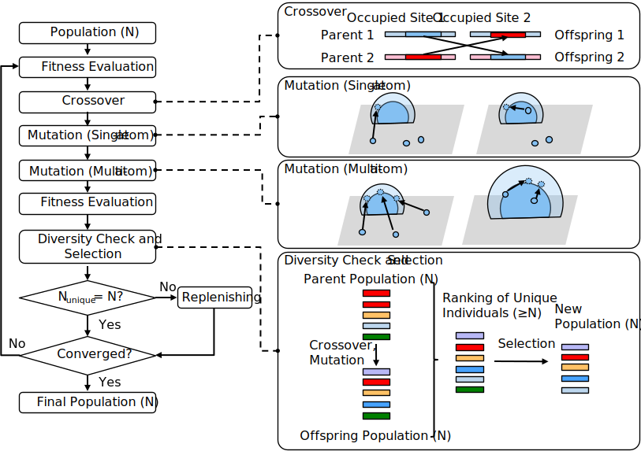

# Cluster Genetic Algorithm (CGA) 

## Usage 

CGA is performed by executing `run_GA.py`.

### Simulation parameters 
- rseed, random seed
- T, temperature
- nseeds, the number of Pd atoms

### Genetic algorithm (GA) hyperparameters
- npop, size of population
- ngen, number of generations
- nfitness, the number of fitness attribute
- cxpb, the probability of mating two individuals
- nremain, the number of individual selected in each iteration

### Flow chart and operators

### Output files describing a CGA trajectory
- `ga_history_output_n_Tk.csv`, the record for each individual in each generation 
- `ga_generation_best_n_Tk.csv`, the record for the fittest individual in each generation
- `ga_stats_output_n_Tk.csv`, the record for the statstics of all individuals in each generation
- `ga_hall_of_frame_n_Tk.csv`, the record for the top physically possible individuals in all generations

### Post-processing 
- Use `process_GA_single.py` to read all output files and generate GA trajectory plots
- Use `process_physics_single.py` to read all output files and generate CNs for each individual
- Use `plot_physics_single.py` to generate CN trajectories  
